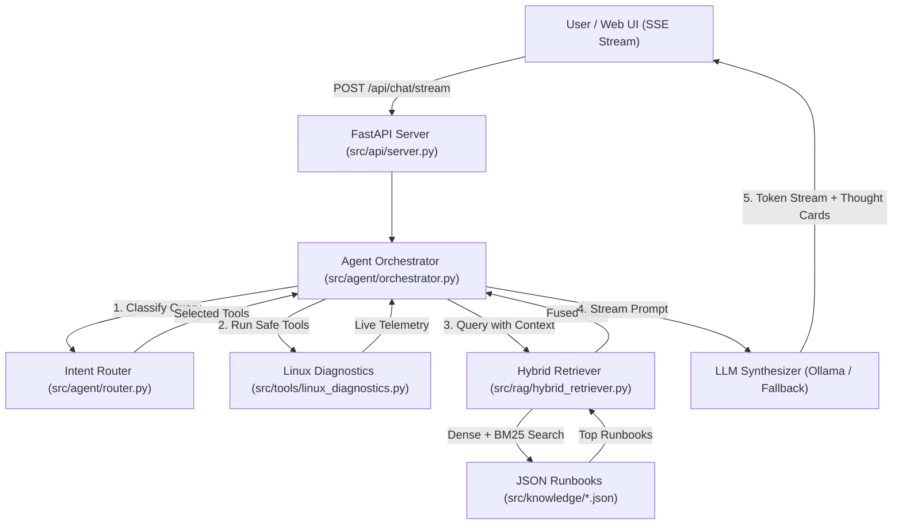

# 🏗️ System Architecture & Self-RAG Design

## 1. Architectural Overview

The **Agentic RAG Assistant** is designed as an autonomous, deterministic, and safe troubleshooting engine. It bridges live operating system observations with verified runbook knowledge bases using a hybrid retrieval mechanism and local LLM reasoning.

---

## 2. Core Subsystems

### A. FastAPI Server (`src/api/server.py`)
- Provides an asynchronous REST and Server-Sent Events (SSE) streaming interface.
- Mounts static frontend assets (`/static`) and exposes endpoints for health, tool execution, and chat streaming.
- Implements strict validation on allowable diagnostic tools via `ALLOWED_TOOLS` set.

### B. Agent Orchestrator (`src/agent/orchestrator.py`)
- Coordinates the end-to-end troubleshooting pipeline:
  1. **Intent Routing**: Categorizes user issues and extracts affected entities (services, ports, error strings).
  2. **Safe Tool Execution**: Runs read-only diagnostic commands asynchronously without blocking the event loop.
  3. **Hybrid Retrieval**: Queries vector and sparse indices to locate relevant remediation runbooks.
  4. **Context Synthesis**: Assembles live telemetry and runbook documentation into a structured prompt.
  5. **Streaming Generation**: Streams thought events, tool output cards, and LLM tokens. Includes a robust deterministic fallback synthesizer if local Ollama instances are offline.

### C. Hybrid Retrieval Engine (`src/rag/hybrid_retriever.py`)
- Combines semantic vector similarity with lexical keyword matching for high-precision error code retrieval:
  - **Dense Search**: Sentence-Transformers (`all-MiniLM-L6-v2`) embedded into a FAISS Inner Product index (`IndexFlatIP`).
  - **Sparse Search**: BM25 keyword matching via `BM25Okapi` with regex-based tokenization.
  - **Reciprocal Rank Fusion (RRF)**:
    $$\text{RRF Score}(d) = \sum_{m \in \{\text{dense}, \text{bm25}\}} \frac{1}{k + r_m(d)}$$
    (where $k = 60$ and $r_m(d)$ is the document rank in model $m$).

### D. Safe System Diagnostics (`src/tools/linux_diagnostics.py`)
- Strictly read-only system inspection:
  - `get_system_overview`: Live uptime, CPU load, memory (`free -h`), disk (`df -h`), and kernel info.
  - `check_service_status`: `systemctl status` and `journalctl -u <service> -n 25`.
  - `check_network_ports`: `ss -tulpn` socket inspection with optional port filtering.
  - `check_journal_errors`: `journalctl -p err..emerg -n <lines>`.
  - `check_disk_inodes`: `df -i` to identify inode exhaustion.
  - `check_oom_events`: Kernel log scanning for Out Of Memory killer events.
- **Safety Guarantees**:
  - `shell=False` execution with explicit argument vectors.
  - Regex sanitization of service names (`^[a-zA-Z0-9@_.-]+$`).
  - Strict execution timeouts (default 10s).

### E. Configuration & Settings (`src/core/config.py`)
- Configured via Pydantic Settings with `.env` file support:
  - `host` & `port`: Network binding.
  - `ollama_base_url` & `ollama_model`: LLM inference settings.
  - `embedding_model`: Sentence transformer model name.
  - `allow_system_inspection`: Boolean master switch for tool execution.
  - `top_k_retrieval` & `min_similarity_score`: RAG threshold controls.
