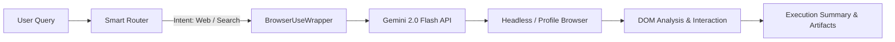

# 🌐 Web & Desktop Automation Integrations

This guide details the automation subsystems developed for the agent, covering AI-controlled browser navigation via `browser-use` and native Windows desktop automation via `windows-use`.

---

## 1. Browser Automation (`browser-use`)

### Overview
The browser automation layer integrates the open-source [`browser-use`](https://github.com/browser-use/browser-use) engine, enabling the assistant to interact directly with web interfaces, extract real-time web documentation, and complete multi-step tasks.

### Architecture


### Key Capabilities
- **Natural Language Navigation**: Translates high-level tasks into browser actions (clicks, form inputs, scrolling).
- **Intelligent Scraping**: Extracts documentation, Microsoft Support articles, and web runbooks.
- **Persistent Profiles**: Supports loading existing Chrome profiles to preserve logins and sessions.
- **Visual WebUI Mode**: Integration with a Gradio-based interface (`launch_browser_webui.py`) for live monitoring and recording.

### Core Methods (`browser_use_wrapper.py`)
```python
class BrowserUseWrapper:
    async def search_and_automate(self, task: str) -> dict:
        """Execute general web automation tasks with LLM vision-action feedback."""
        ...

    async def web_search(self, query: str) -> str:
        """Search Google/Bing and extract synthesized snippets."""
        ...

    async def fill_form(self, url: str, form_data: dict) -> dict:
        """Navigate to URL and fill out specified form fields."""
        ...
```

---

## 2. Desktop Automation (`windows-use`)

### Overview
The Windows automation subsystem utilizes [`windows-use`](https://github.com/windows-use) to provide GUI-level and system-level task execution on Windows environments.

### Capabilities
- **Application Control**: Launching and manipulating Windows desktop apps (e.g., Notepad, Calculator, Outlook, Settings).
- **File System Navigation**: Opening specific folders in File Explorer and locating log files.
- **Settings Automation**: Direct navigation to Windows settings pages (Network, Apps, Update & Security).
- **Text Entry & Key Strokes**: Typing into active application windows and submitting keyboard shortcuts.

### Core Methods (`windows_use_wrapper.py`)
```python
class WindowsUseWrapper:
    def open_application(self, app_name: str) -> dict:
        """Launch Windows executable by name or path."""
        ...

    def open_settings(self, section: str) -> dict:
        """Launch specific Windows ms-settings URI."""
        ...

    def open_file_explorer(self, path: str) -> dict:
        """Open Windows File Explorer at target location."""
        ...

    def execute_command(self, cmd: str) -> dict:
        """Execute sanitized PowerShell/CMD utility."""
        ...
```

---

## 3. Gemini API Integration & Quota Management

Both browser and desktop automation modules utilize Google's Gemini models for multimodal perception and vision-driven action decision:

* **Primary Model**: `gemini-2.0-flash-exp` (fast inference and vision tokens).
* **Quota Management**:
  - Free Tier Allocation: Shared pool of daily requests.
  - Quota Tracking: In-memory counter tracking daily usage (`daily_requests_count`) to avoid rate limit exceptions (`429 RESOURCE_EXHAUSTED`).
  - Fallback: Graceful degradation to local Ollama text reasoning or deterministic offline advice when API limits are hit.
