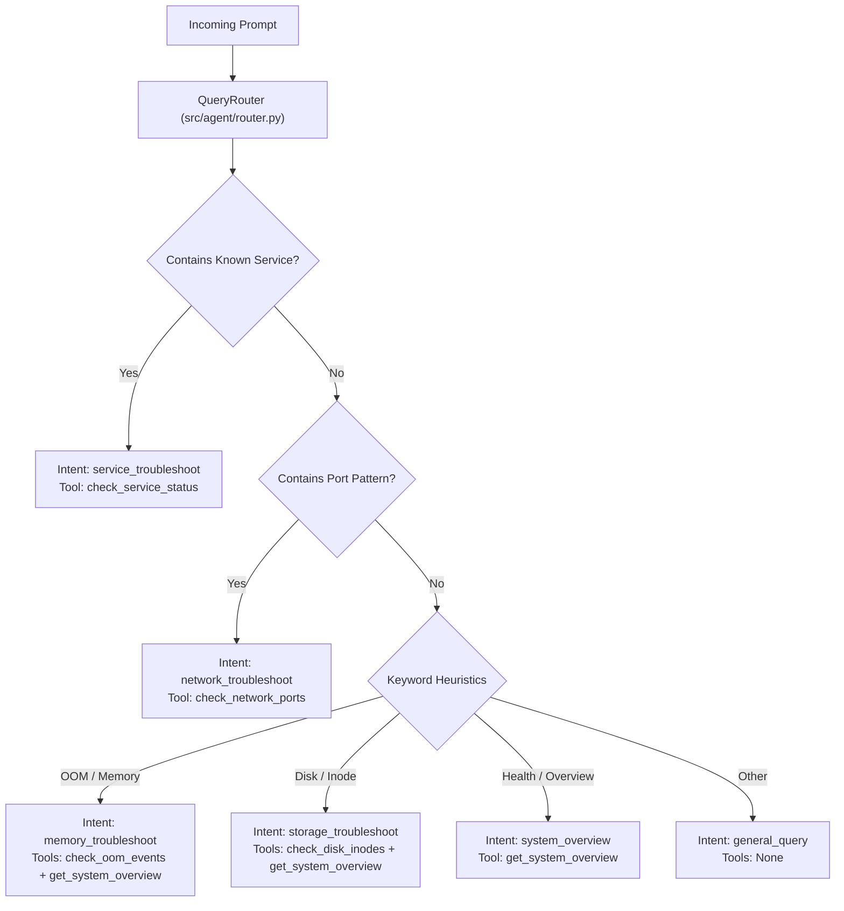

# 🧭 Smart Routing & Intent Classification

The routing engine classifies incoming user queries, extracts target system entities, and determines the optimal diagnostic tools and retrieval queries.

---

## 1. Intent Classification Architecture



---

## 2. Entity Extraction Logic

### A. Known Service Detection
The router scans for 19+ standard Linux services:
```python
KNOWN_SERVICES = [
    "nginx", "apache2", "httpd", "caddy", "docker", "containerd", "podman",
    "mysql", "mariadb", "postgresql", "postgres", "redis", "mongodb",
    "ssh", "sshd", "systemd-resolved", "ufw", "firewalld", "cron", "crond"
]
```
If a known service is detected via boundary-aware regex (`\b{service}\b`), the router assigns `target_service` and enqueues `check_service_status(service_name=target_service)`.

### B. Port Number Extraction
Detects ports formatted as:
- Explicit word: `port 8080`, `port 443`, `port 22` (`\bport\s*(\d{2,5})\b`)
- Colon format: `:8080`, `:3000`, `:5432` (`:(\d{2,5})\b`)

The extracted port is forwarded to `check_network_ports(filter_term=target_port)`.

### C. Error Signatures
Identifies exact Linux kernel, systemd, and network error codes:
- `status=203/EXEC`, `exit code` -> Dispatches `check_service_status` or `check_journal_errors`.
- `ECONNREFUSED`, `connection refused`, `address already in use` -> Dispatches `check_network_ports`.
- `oom-killer`, `out of memory`, `killed process` -> Dispatches `check_oom_events`.
- `no space left on device`, `inodes 100%` -> Dispatches `check_disk_inodes`.

---

## 3. Query Enhancement for Hybrid Retrieval

Before dispatching the query to the Hybrid Retriever (Dense + BM25), the router enriches the query string:
- If a specific service was extracted (e.g., `nginx`) and is not explicitly in the query text, it is prepended (`"nginx " + query`).
- This ensures that both lexical search (`BM25Okapi`) and semantic embeddings (`SentenceTransformer`) match the exact service runbooks even if the user typed informal symptoms (e.g. "it won't start after editing config").
