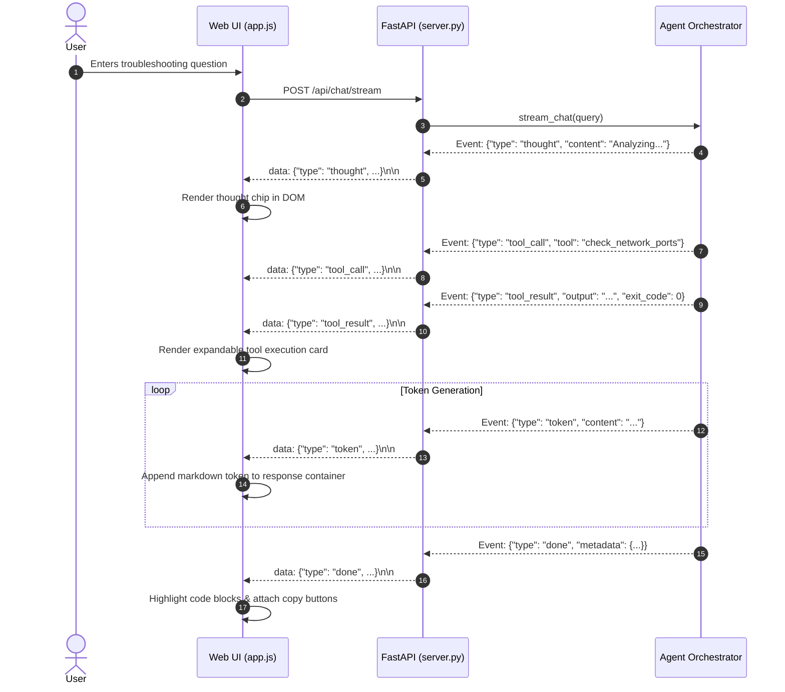

# 💻 Frontend UI & Multimodal Interactions

This guide documents the user interface design, Server-Sent Events (SSE) streaming mechanics, and multimodal audio features (Voice Input and Text-to-Speech).

---

## 1. DevOps Terminal UI Architecture

The frontend (`static/index.html`, `static/style.css`, `static/app.js`) provides a dark-mode, terminal-inspired interface engineered for Linux administrators and DevOps engineers.

```
┌────────────────────────────────────────────────────────────────────────┐
│ 🐧 LINUX AGENTIC TROUBLESHOOTING ASSISTANT          [● Online] [v2.0]   │
├────────────────────────────────────────────────────────────────────────┤
│ Quick Diagnostics:                                                     │
│ [⚡ System Overview] [🔌 Listening Ports] [📜 Journal Errors] [💾 Disk]│
├────────────────────────────────────────────────────────────────────────┤
│ Chat Log:                                                              │
│                                                                        │
│ 👤 User: Why is nginx failing to bind to port 80?                      │
│                                                                        │
│ 🤖 Agent:                                                              │
│   💭 Thinking: Classified intent as network_troubleshoot...            │
│   ┌─ Tool Executed: check_network_ports (Exit Code: 0) ──────────────┐ │
│   │ tcp  LISTEN  0  128  0.0.0.0:80  users:(("apache2",pid=1024))    │ │
│   └──────────────────────────────────────────────────────────────────┘ │
│   ### Root Cause                                                       │
│   Port 80 is already occupied by the `apache2` service.                │
│                                                                        │
│   ### Remediation                                                      │
│   ```bash                                                              │
│   sudo systemctl stop apache2                                          │
│   sudo systemctl start nginx                                           │
│   ```                                            [📋 Copy Command]     │
├────────────────────────────────────────────────────────────────────────┤
│ 💬 [ Ask a Linux diagnostic question...                         ] [Send]│
└────────────────────────────────────────────────────────────────────────┘
```

---

## 2. Real-Time Streaming Mechanics (SSE)

The web client communicates with the server via `/api/chat/stream` using an asynchronous `fetch` stream reader:



---

## 3. Multimodal Voice & Audio (TTS)

To enhance hands-free accessibility during active sysadmin triage sessions:

### Text-to-Speech (TTS)
- **Engine**: Browser-native `window.speechSynthesis` API for zero-latency, local voice synthesis.
- **Controls**:
  - Global voice toggle in the status header (`Voice: ON / OFF`).
  - Per-message speaker icon (`🔊`) allowing manual playback of remediation steps.
  - Filter logic: Strips bash code blocks before vocalization to avoid reading raw shell syntax.

### Speech-to-Text (Voice Input)
- **Engine**: `webkitSpeechRecognition` / `SpeechRecognition` API.
- **Microphone Button**: Toggles active speech capture, converting spoken symptoms directly into the query input field.
